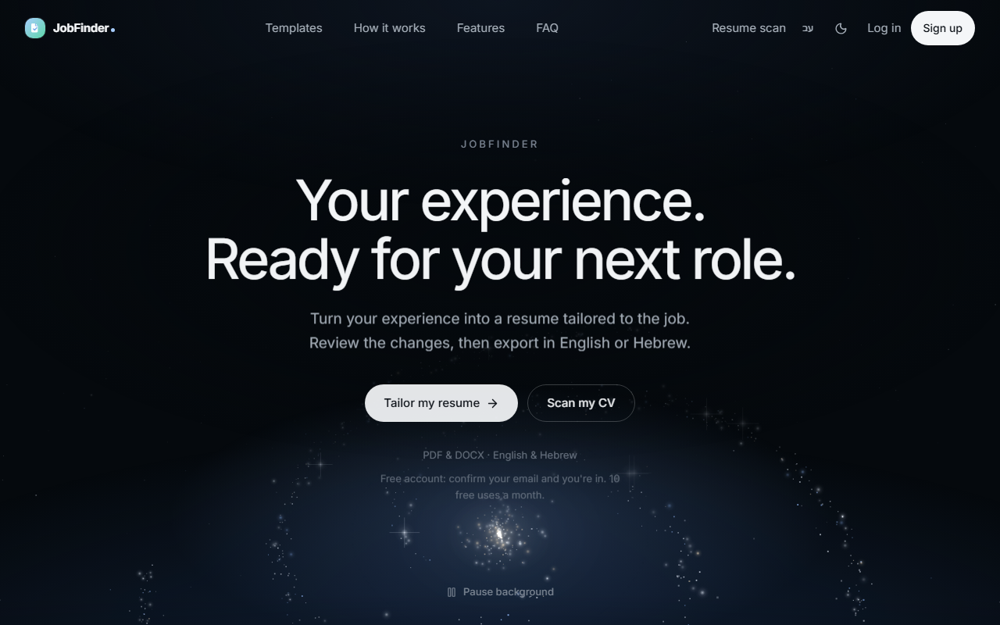

# JobFinder AI

An AI resume tailor that shows its work. It rewrites a resume for one specific job, in English or Hebrew, then a deterministic guard compares the result with the original and flags any employer, title, date, credential or number that was not there before.

**Status:** deployed at [jobfinder-hazel-pi.vercel.app](https://jobfinder-hazel-pi.vercel.app) with free accounts and a monthly use limit. Pricing has not been decided, so there is no paid tier. Built and maintained by one engineer.



<!-- SCREENSHOT TO ADD: a signed-in tailor result (trust panel, before and after keyword coverage, changelog). Save as docs/screenshots/tailor.png and reference it here. -->

## What it does

- **Tailors a resume to a job description**: before and after keyword coverage, an LLM fit score, a full changelog, and a trust panel listing anything the guard flagged.
- **ATS X-ray**: renders the finished file and reads it back with a parser, so the user sees what an applicant tracking system will actually extract.
- **12 resume templates** that differ in layout, not just colour, rendered as DOCX and PDF in English and Hebrew (right to left).
- **Job search across 11 boards**: Israeli boards (Drushim, JobMaster), company ATS feeds (Comeet, Greenhouse, Lever, SmartRecruiters, Ashby), LinkedIn, and worldwide remote feeds, each posting scored against the saved resume.
- **Interview prep**: likely questions, answers grounded in the resume, and a multi-turn mock interview with a scorecard.
- **Application tracker**: a kanban board of jobs, resume versions, scores and status.

## How a resume moves through it

Each step's output is the next step's input. The two guard steps are plain code, not model calls.


## What's interesting in here

**1. The model may reword a role. It may not promote you or invent an employer.**
The facts ledger is built from the original resume, and [`fabrication_guard.py`](backend/app/core/fabrication_guard.py) diffs every employer, title, date, institution, degree, credential, number and military entry in the tailored output against it. Headlines get their own check: restating your work in the target role's words is allowed, but a rank you never held ("Senior", "Lead", "Head of", and the Hebrew equivalents) is flagged. One failure needed more than a flag. When the prompt protected roles but let projects be dropped, the model saved a project it liked by moving it into the experience section, which produced a resume claiming employment at "JobFinder AI". Flags are advisory, so `drop_invented_roles` now removes any experience entry whose employer the ledger has never seen, and the changelog records the removal. The UI follows the same rule: it says "no new claims detected", never "verified".

**2. Showing the parse instead of claiming it.**
Most resume builders say their templates are ATS-safe. [`ats_xray.py`](backend/app/core/ats_xray.py) uses the app's own renderer and parser to prove it per document, marking each protected fact as clean, wrapped, collided or lost. The main finding: PDF text extraction sorts by vertical position across the whole page, so a two-column layout glues the sidebar onto the main column ("Python Go PostgreSQL Senior Backend Engineer"). Changing the draw order does not help (measured), so the two-column templates are PDF only and never the default, and the X-ray shows the user exactly what that costs.

**3. Measuring the real model, because the offline stub cannot.**
The whole pipeline runs offline against a stub, which proves routing and shapes but says nothing about output quality. [`ab_tailor.py`](backend/tests/ab_tailor.py) is a paid, real-model harness with the decision rule written before each run. It found that the prompt asked for 15 to 25 skills while tailored resumes shipped a median of 63.5, cut from a 66-skill master, with only 18.6% of them terms the job named. Five prompt-only fixes were measured and every one that shortened the list lost keyword coverage, by up to 13.2 points. So the limit became code, [`skills_shortlist.py`](backend/app/core/skills_shortlist.py), which never drops a skill the job asks for. Across 12 paired job runs it took the list from 63.5 to 20 skills and precision from 18.6% to 55.0%, with coverage, lost keywords, fabrication flags and page count unchanged. The same harness gave the first real cost figure: about $0.005 per tailor. Write-ups are in [`docs/handbook/skills.md`](docs/handbook/skills.md) and [`docs/handbook/testing.md`](docs/handbook/testing.md).

**4. Hebrew is the primary market, and Hebrew prefixes broke the matcher.**
Hebrew attaches prepositions and articles to the front of the noun, so a word-boundary regex that passes every English test silently reports Hebrew keywords as missing. Keyword matching lives in exactly one function, [`scorer._keyword_present`](backend/app/core/scorer.py), with an asymmetric boundary, and is never recomputed in TypeScript (a build check enforces this). A second Hebrew bug: the language did not survive a page reload, because the code read an i18next field that is only set once translations are loaded, and the translations now loaded after startup. The fix and its explanation are in [`frontend/src/i18n.ts`](frontend/src/i18n.ts).

## Testing

- **Backend:** [`smoke_test.py`](backend/tests/smoke_test.py) runs over 2,000 checks offline with no API key: parsing, the ledger and guard, rendering, cost caps and token metering, accounts, every LLM task through the stub. Any new LLM task must add a stub branch and a check.
- **CI runs it once, with no retry.** There used to be an `|| retry` for one flaky check. The file is straight-line code, so an exception aborts every check after it, and under `A || A` a random crash could produce a green build with around 865 checks never executed. The retry is gone, and an exit hook now prints how many checks ran before an abort. See [`.github/workflows/ci.yml`](.github/workflows/ci.yml).
- **Frontend:** [`check-mirrors.js`](frontend/scripts/check-mirrors.js) runs first in every build. It holds over 100 numbered checks, each pinned to a defect that actually shipped and that `tsc` cannot see: locale key parity between English and Hebrew, nav entries that resolve to real routes, every resume field surviving a merge.

## Stack

- **Backend:** Python 3.12, FastAPI, Pydantic, SQLAlchemy (SQLite locally, Neon Postgres in production), python-docx, pdfplumber, reportlab, python-bidi, OpenAI behind a provider-agnostic client with an offline stub, Sentry
- **Frontend:** React 18, Vite, TypeScript, React Router, Tailwind, framer-motion, i18next (English and Hebrew)
- **Deployment:** one Vercel project running the Vite frontend and the FastAPI backend as two services, with scheduled jobs for alerts and reminders; GitHub Actions for CI

## How it was built

I built this alone, with Claude Code as a pair programmer. I own the architecture, the test strategy and every product decision, which is why most commits carry a Claude co-author line. [`CLAUDE.md`](CLAUDE.md) holds the architecture and the rules the codebase keeps, and [`docs/handbook`](docs/handbook) has a write-up per subsystem. The product plan is kept private, so references to `PLAN` sections in the code point at a document that is not in this repository.

## Run locally

**Backend**

```bash
cd backend
python -m venv .venv
.venv\Scripts\activate          # Windows; use source .venv/bin/activate elsewhere
pip install -r requirements.txt
copy .env.example .env          # add OPENAI_API_KEY, or set USE_STUB_LLM=true
uvicorn app.main:app --reload --port 8000
```

API docs are at http://localhost:8000/docs. A SQLite database is created on first start.

**Frontend**

```bash
cd frontend
npm install
npm run dev                     # http://localhost:5173
```

Vite proxies `/api/*` to `127.0.0.1:8000`.

**Offline mode:** with `USE_STUB_LLM=true` the whole pipeline (parse, score, tailor, render, track) runs on canned model responses, so no API key is needed.

**Tests**

```bash
cd backend && python -m tests.smoke_test     # exit 0 means every check passed
cd frontend && npm run build                 # runs check-mirrors.js, then tsc, then vite build
```

## License

All rights reserved. See [LICENSE](LICENSE).
